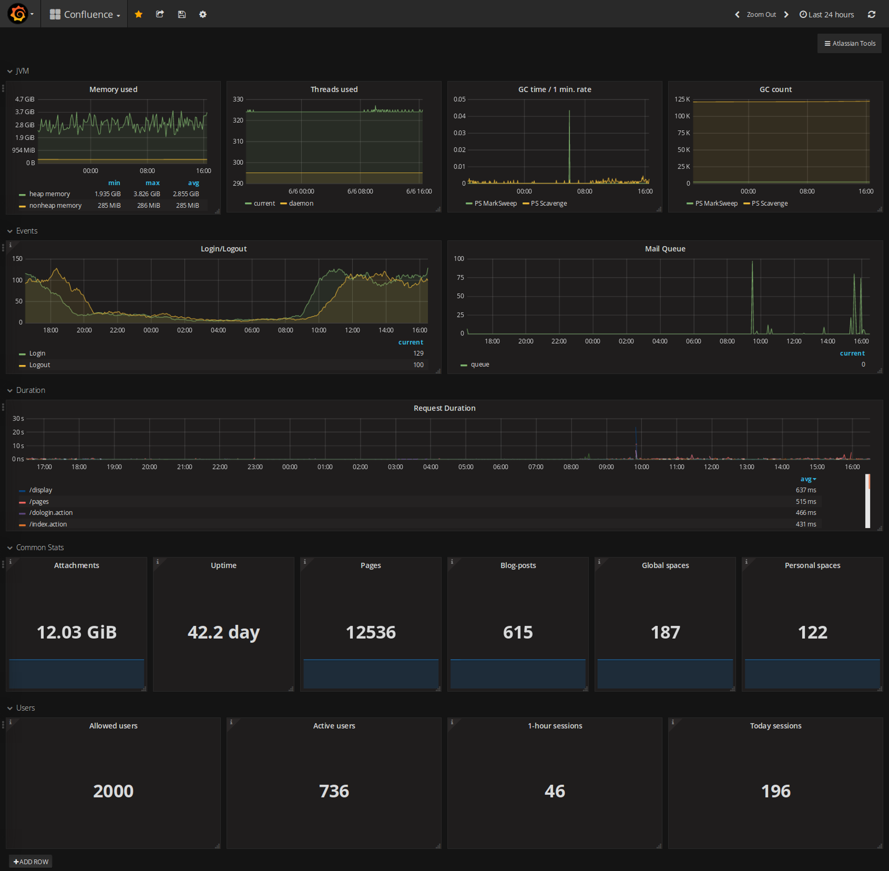

# Prometheus Exporter For Confluence 

This is Confluence plugin which provides endpoint to expose Confluence metrics to Prometheus.

For more information the documentation [Prometheus Exporter For Confluence](https://github.com/AndreyVMarkelov/prom-confluence-exporter/wiki/Prometheus-Exporter-For-Confluence).

On Atlassian Marketplace [Prometheus Exporter For Confluence](https://marketplace.atlassian.com/plugins/ru.andreymarkelov.atlas.plugins.prom-confluence-exporter/server/overview)

## Grafana 

* [Example Grafana Dashborad](https://grafana.com/dashboards/6404)

